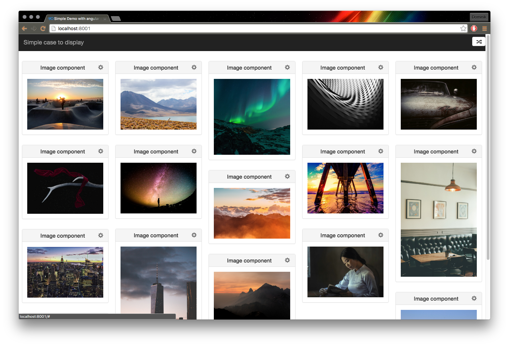

# 


# angular-dashboard

[](https://travis-ci.org/fluanceit/angular-dashboard)

A simple framework to have multiple components organized in a dashboard for your angular app. Dashboard layout is persistently saved according to resolution, so you can even save personal layouts for different resolutions. Start by creating your own component or reuse the built in image component.

Documentation available at : [http://fluanceit.github.io/angular-dashboard/](http://fluanceit.github.io/angular-dashboard/)

## Install

```
$ bower install --save https://github.com/fluanceit/bower-angular-dashboard.git
```

Installs the bower distribution of the angular dashboard and all its dependencies (which are not that much).

Note: We plan on contributing our dashboard to the official bower repository but did not engage ourselves for it until now.

## Setup

	<script type="text/javascript">
	    var myApp = angular.module('myApp', ['dashboard']);
	    myApp.controller('myController', ['$scope', 'dashboardFactory', 'imagesComponent',
	        function($scope, fluanceDashboard, ImageComponent) {
				$scope.dashboard = fluanceDashboard.get('simple-demo');
				$scope.dashboard.add(new ImageComponent({'url': 'https://image.url/img.jpg'})); // Or any other component...
	        	}
	    	}	
		]);
	</script>

Sets up a new dashboard ```simple-demo``` and adds one new ``ImageComponent```.


## Sortable

The dashboard implements a feature to rearrange its components (persistently saved too). You therefore have to provide a toggle-function:

	<script type="text/javascript">
	    ... // Setup up dashboard

	    $scope.toggleSortable = function() {
            $scope.dashboard.toggleSortable();
            if(!$scope.dashboard.isStateSorting) {
                sessionStorage.setItem('cockpit', $scope.dashboard.toString());
            }
    	};
	</script>

Saves the current dashboard to sessionStorage when rearranging is finished (toggle-function triggered).

## Loading

	<script type="text/javascript">
	    if (sessionStorage.getItem('cockpit')) {
            $scope.dashboard.fromString(sessionStorage.getItem('cockpit'));
        } else {
            $scope.dashboard.add(new ImageComponent({'url': 'https://image.url/img.jpg'})); // Or any other component...
        }
	</script>

Instead of creating a new dashboard when starting the app, you can load your dashboard object from sessionStorage, where it has been saved e.g. by the toggle-function.

## Custom components

### Requirements

First of all, **do not forget to load your components in index.html** (or otherwise according to your project).

Components have to fullfill a small contract, lets call it an interface, so they fit well into the dashboard.

### component.service.js

	<script type="text/javascript">
	     var componentName = 'imagesComponent';

	    angular
	        .module('dashboard')
	        .service(componentName, ImagesComponent);

	    ImagesComponent.$inject = [];

	    function ImagesComponent() {
	        // Return a function to be used as new ImagesComponent();
	        return function(params) {
	            return {
	                name: componentName,
	                params: params,
	                states: {
	                    'default': {
	                        template: '/demos/simple/components/images.templates.html',
	                        controller: function () {
	                            console.log('Open default state');
	                        }
	                    },
	                    'extended': {
	                        template: '/demos/simple/components/images.templates.extended.html'
	                    },
	                    'settings': {
	                        template: '/demos/simple/components/images.templates.settings.html',
	                        controller: function () {
	                            console.log('Open settings state');
	                        }
	                    }
	                }
	            };
	        };

	    }
	</script>

With this service you provide the basic functionality of your component, so that you can extend it (full width of dashboard) or show it's settings page if it has any.

### component.templates.{template}.html

Additionally, you will have to provide these templates, your component supports (it may be that you component has no settings, so in this case you won't have to provide a ```component.templates.settings.html```).

	<div class="panel panel-default image-component">
	    <div class="panel-heading">
	        <h3 class="panel-title">
	            <span style="float: left; color: #777;" class="sortable-handle"><i class="glyphicon glyphicon-move" ng-show="dashboard.isStateSorting"></i></span>
	            Image component
	            <a style="float: right; color: #777;" href="#" ng-click="openSettings()"><i class="glyphicon glyphicon-cog"></i></a>
	        </h3>
	    </div>
	    <div class="panel-body">
	        <a href="#" ng-click="openExtended()">
	            
	        </a>
	    </div>
	</div>

This is the demo images.templates.html (so the basic template, not extended and not the settings).

**Note:**

* You should provide a sort-handle so that when the user arranges his dashboard he can see the difference.
* When needed, provide the possiblity to open the components settings.
* Provide a way to open the extended view
* In the respective templates make sure, that you offer the needed functions to close the settings and/or extended view.

### Additional files

Of course your component can use more files than just those, just import them correctly and it should work like a charm.

Your components folder could look like this:

	├── specialComponent
	│   ├── specialComponent.service.js*
	│   ├── specialComponent.styles.css*
	│   ├── specialComponent.templates.extended.html
	│   ├── specialComponent.templates.html
	│   └──  specialComponent.templates.settings.html

* Items need to be imported in **index.html**

# Contribution

1. Fork this repository
2. Activate **travis-ci** on your new repo
3. Push your modification
4. Merge original repo to make merge automatic
5. Create a pull request from your fork
6. Sacrify some kitten to help getting luck

# License
Apache License Version 2.0, January 2004